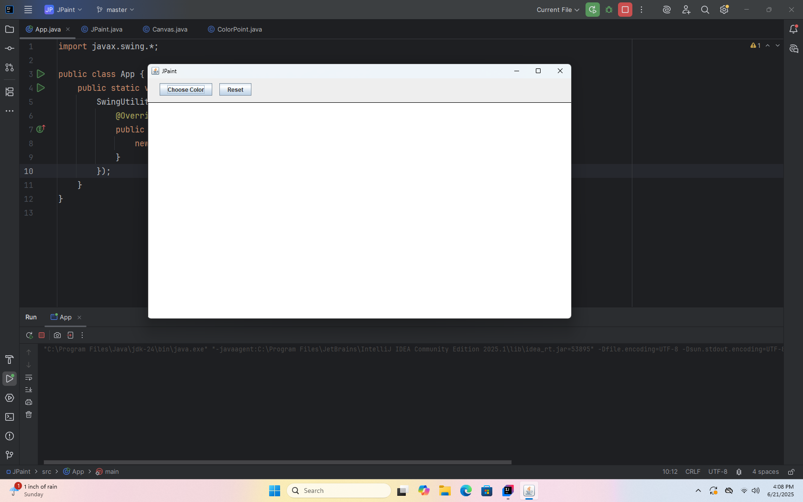
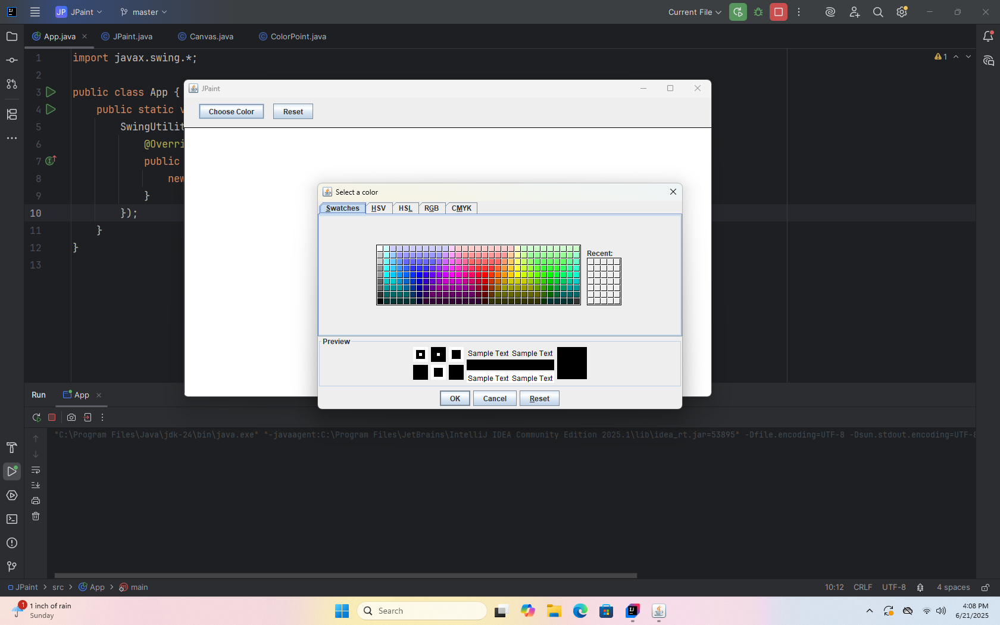

# 🎨 JPaint

**JPaint** is a simple yet powerful Java-based painting tool built with **Swing** and **AWT**. It allows users to draw freely on a canvas with customizable brush colors and provides an intuitive interface for artists, hobbyists, and developers to enjoy.

---

## 🛠 Features

- 🖌️ Freehand drawing on a canvas  
- 🌈 Customizable color palette  
- 🧽 Clear/Reset canvas functionality  
- 💾 Lightweight and fast – written in pure Java  
- 🪟 Built using Swing and AWT – no external dependencies  

---

## 📸 Preview
 
> 
> 

---

## 🚀 Getting Started

### Requirements

- Java JDK 8 or above  
- Any IDE like IntelliJ IDEA, Eclipse, or simply command line

---

### 🔧 Installation

1. **Clone the repository:**
   ```bash
   git clone https://github.com/AshmitDas19/JPaint.git
   cd JPaint
   ```

2. **Compile the code:**
   ```bash
   javac JPaint.java
   ```

3. **Run the application:**
   ```bash
   java JPaint
   ```

---

## 🧑‍💻 Usage

- 🖱️ Use your mouse to draw on the canvas  
- 🎨 Click on the color picker to change brush color  
- 🗑️ Use the **Reset** button to clear the canvas

---

## 📂 Project Structure

```
JPaint/
├── .idea/
│   ├── .gitignore
│   ├── misc.xml
│   └── modules.xml
├── src/
│   ├── App.java
│   ├── Canvas.java
│   ├── ColorPoint.java
│   └── JPaint.java
├── .gitignore
├── JPaint.iml
├── LICENSE
└── README.md
```

---

## 🙋 FAQ

**Q: Can I contribute new features?**  
A: Yes! Pull requests are welcome. Please see [Contributing](#-contributing) below.

---

## 🤝 Contributing

1. Fork the repo  
2. Create your feature branch: `git checkout -b feature-name`  
3. Commit your changes: `git commit -m 'Add new feature'`  
4. Push to the branch: `git push origin feature-name`  
5. Open a Pull Request

---

## 📜 License

This project is licensed under the [MIT License](https://github.com/AshmitDas19/JPaint/blob/53e29973b5ad62a1a907a4e80db5a51752e2fee1/LICENSE).

---

## 💬 Contact

Feel free to reach out or open an issue if you face any problems.

> Made With ❤️ in Java
